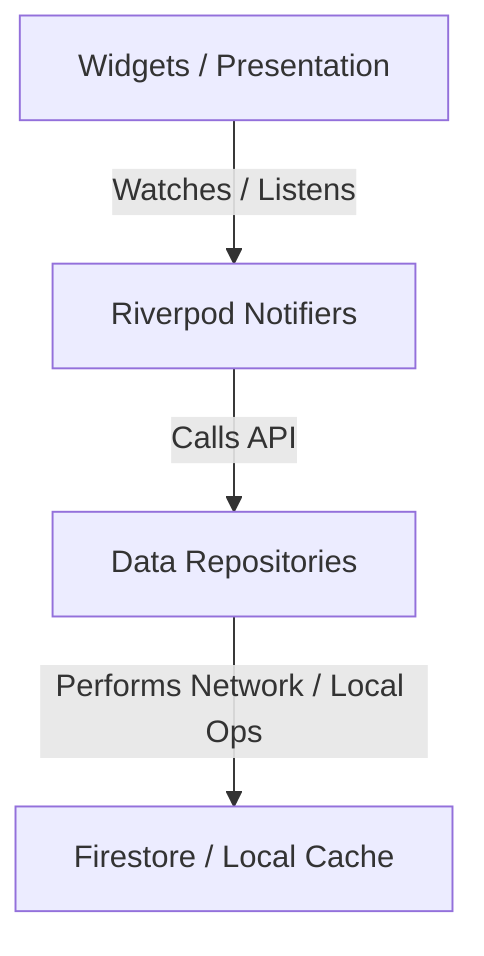

# SparkleLite 🌟

SparkleLite is a premium, privacy-focused women's health tracking application that integrates a cross-platform Flutter frontend with a serverless Node.js/TypeScript backend powered by Google Firebase. Designed to prioritize user data security and compliance, the app supports menstrual cycle tracking, symptom logs, medical record uploads, automated AI insights, doctor visit summary builders, and family profiles with granular access controls.

---

## 1. Project Overview

The project is structured as a monorepo containing the mobile/web frontend and the cloud backend infrastructure:

```
SparkleLite/
├── README.md                      # Project documentation (this file)
├── women_health/                  # Flutter mobile & web application
│   ├── lib/
│   │   ├── main.dart              # App entry point & Firebase/emulator initialization
│   │   ├── core/                  # Core routing, themes, constants, and utilities
│   │   │   ├── routing/           # AppRouter configuration using GoRouter
│   │   │   ├── theme/             # Styling & app themes (light/dark mode)
│   │   │   └── constants/         # Global strings and app configuration
│   │   ├── data/                  # Global data sources, repositories, and models
│   │   │   ├── models/            # Freezed data models (HealthProfile, SymptomLog, etc.)
│   │   │   └── repositories/      # Repositories for Firestore & Mock backend configurations
│   │   └── features/              # Feature-oriented codebase structure
│   │       ├── ai_insights/       # AI symptom trend engine (rule-based compliance checks)
│   │       ├── auth/              # Signup and Login flow
│   │       ├── dashboard/         # Central summary metrics dashboard
│   │       ├── doctor_summary/    # Doctor appointment prep sheet builder
│   │       ├── health_records/    # Clinical document upload & categorization
│   │       ├── reminders/         # Cycle logging & medication reminders
│   │       └── settings/          # Security, granular privacy controls, and family setup
│   ├── test/                      # Widget and unit tests for Flutter pages/logic
│   └── pubspec.yaml               # Flutter app dependencies and config
│
└── sparkle-lite-backend/          # Firebase Backend project
    ├── firebase.json              # Firebase configuration & emulator suite definitions
    ├── firestore.rules            # Granular Firestore security access control rules
    ├── storage.rules              # Cloud Storage access rules
    ├── scripts/                   # Seeding scripts for local emulator development
    │   └── seed-emulator.ts       # Seeds a mock user, logs, records, and family data
    └── functions/                 # TypeScript Firebase Cloud Functions
        ├── package.json           # Node configuration and functions scripts
        ├── tsconfig.json          # TypeScript compilation options
        ├── src/
        │   ├── index.ts           # Cloud functions exports
        │   ├── callable/          # HTTPS callable cloud endpoints
        │   │   ├── generateAIInsight.ts
        │   │   ├── generateDoctorSummary.ts
        │   │   ├── exportUserData.ts
        │   │   └── deleteAccount.ts
        │   ├── triggers/          # Firestore and Auth background event triggers
        │   │   └── onUserDelete.ts
        │   └── utils/             # Local helper utilities (AI insight & summary engines)
        └── test/                  # Integration & unit tests for Cloud Functions
```

---

## 2. Tech Stack Used

### Frontend (`women_health/`)
* **Framework**: Flutter & Dart (Cross-platform iOS, Android, and Web)
* **State Management**: [Flutter Riverpod](https://pub.dev/packages/flutter_riverpod) & `riverpod_generator` (Type-safe dependency injection and reactive state caching)
* **Navigation**: [GoRouter](https://pub.dev/packages/go_router) (Declarative routing supporting nested routes and guard redirects)
* **Data Serialization**: [Freezed](https://pub.dev/packages/freezed) & `json_serializable` (Type-safe immutability, union types, and automatic JSON generation)
* **UI/Styling**: Material Design 3, Google Fonts (custom high-quality typography), Cupertino Icons
* **Local Caching**: `shared_preferences` & `path_provider`
* **File Management**: `file_picker` (Medical report selection) & `pdf` (Clinical PDF export generation)

### Backend (`sparkle-lite-backend/`)
* **Platform**: Google Firebase
* **Cloud Functions**: Node.js (v20) with TypeScript (Express-style HTTPS callable functions and background triggers)
* **Database**: Cloud Firestore (NoSQL hierarchical database structured as namespaces)
* **Authentication**: Firebase Authentication
* **Storage**: Firebase Cloud Storage (PDF/Image file hosting)
* **App Verification**: Firebase App Check (Play Integrity for Android, Device Check for iOS, ReCaptcha v3 for Web)
* **Validation**: Zod (TypeScript runtime type checking)

### Testing Suite
* **Frontend**: `flutter_test`, `mocktail` (Mocking and widget test framework)
* **Backend**: `jest`, `ts-jest`, `@firebase/rules-unit-testing` (Integration and Unit testing against local emulators)

---

## 3. Flutter Version Used

The Flutter project is configured with the following SDK environment constraint:
```yaml
environment:
  sdk: '>=3.2.6 <4.0.0'
```
* **Required Flutter SDK**: **Flutter 3.16.x or newer** (Stable channel recommended, e.g., 3.19.x / 3.22.x).
* **Target Dart Version**: **Dart 3.2.6 or newer**.

---

## 4. Setup Instructions

Follow these instructions to run the SparkleLite project locally on your machine.

### Prerequisites
1. Install **Flutter SDK** (3.16.x+) by following the official [Flutter installation guide](https://docs.flutter.dev/get-started/install).
2. Install **Node.js v20.x** and **npm** from [nodejs.org](https://nodejs.org/).
3. Install the **Firebase CLI**:
   ```bash
   npm install -g firebase-tools
   ```
4. Install **Java Development Kit (JDK 11+)** (required to run the local Firebase Emulator Suite).

### Backend Setup
1. Navigate to the backend directory:
   ```bash
   cd sparkle-lite-backend
   ```
2. Navigate to the cloud functions directory and install dependencies:
   ```bash
   cd functions
   npm install
   ```
3. Build the Cloud Functions TypeScript files:
   ```bash
   npm run build
   ```

### Frontend Setup
1. Navigate to the frontend directory:
   ```bash
   cd ../../women_health
   ```
2. Fetch Dart dependencies:
   ```bash
   flutter pub get
   ```
3. Run the code generation tool (`build_runner`) to compile Freezed models and Riverpod providers:
   ```bash
   flutter pub run build_runner build --delete-conflicting-outputs
   ```

---

## 5. Firebase Setup Instructions

SparkleLite supports both local development (using the **Firebase Emulator Suite**) and production deployment.

### Option A: Local Emulator Suite (Recommended for Development)
The application is pre-configured to connect to the local emulators.

1. In the `sparkle-lite-backend` folder, run the Firebase Emulator Suite:
   ```bash
   firebase emulators:start
   ```
   *Note: This starts Firestore, Authentication, Functions, Storage, and the Emulator Suite UI.*
2. **Seed Local Database**: While the emulator is running, open a new terminal window in `sparkle-lite-backend` and seed the local environment with a default test user:
   ```bash
   # From sparkle-lite-backend directory
   npm run seed --prefix functions
   # or
   npx ts-node scripts/seed-emulator.ts
   ```
   This creates a developer login:
   * **Test Email**: `test@sparklelite.dev`
   * **Password**: `Test1234!`
   * **Default Data**: Pre-seeded health profile, symptom logs, sample health records, and family members.

3. **Check Connection IP**:
   In `women_health/lib/main.dart`, the app targets the emulator. On real mobile devices or Android Emulators, change the hardcoded host machine IP `192.168.29.9` to your computer's local network IP or `10.0.2.2` (Android emulator loopback).

### Option B: Connecting to a Live Firebase Project
To connect to your own cloud instance:
1. Initialize a new project on the [Firebase Console](https://console.firebase.google.com/).
2. Enable **Authentication** (Email/Password), **Cloud Firestore**, **Cloud Storage**, and **Cloud Functions**.
3. Register your Flutter App on the project console and download the configuration files:
   * Android: `google-services.json` placed in `women_health/android/app/`
   * iOS: `GoogleService-Info.plist` placed in `women_health/ios/Runner/`
   * Or configure automatically using the FlutterFire CLI: `flutterfire configure`
4. Deploy the database rules and cloud functions from `sparkle-lite-backend`:
   ```bash
   firebase use --add [your-project-id]
   firebase deploy --only firestore,storage,functions
   ```

---

## 6. How to Run Mobile

1. Open your simulator (iOS/Android) or connect a physical debugging device.
2. Ensure the Firebase Emulator is running (`firebase emulators:start` in backend root).
3. Navigate to the `women_health` directory:
   ```bash
   cd women_health
   ```
4. Run the app:
   ```bash
   flutter run
   ```

---

## 7. How to Run Web

1. Ensure the Firebase Emulator is running (`firebase emulators:start` in backend root).
2. Navigate to the `women_health` directory:
   ```bash
   cd women_health
   ```
3. Run the app target in Chrome:
   ```bash
   flutter run -d chrome
   ```

---

## 8. How to Run Tests

### Frontend (Flutter Tests)
Run the widget, unit, and model validation tests using:
```bash
cd women_health
flutter test
```

### Backend (Cloud Functions & Firestore Rules Tests)
Unit and integration tests for functions are built using Jest.
1. Navigate to the `functions` directory:
   ```bash
   cd sparkle-lite-backend/functions
   ```
2. Run Jest tests:
   ```bash
   npm run test
   ```

---

## 9. Architecture Explanation

### Clean & Feature-First Directory Structure
SparkleLite is architected using a **Feature-First Clean Architecture** within Flutter. By clustering code into features (e.g. `auth`, `symptom_tracker`, `ai_insights`), features remain isolated, self-contained, and highly maintainable.

```
women_health/lib/
├── core/                 # Shared layers: themes, routing guards, strings
└── data/                 # Data contracts: repositories and entity models
└── features/             # Feature folders containing UI & controllers
```

### Flow Architecture



### Security-First Backend Pathing
Our Firestore database design strictly separates user namespaces. High-grade security rules restrict all read/write capabilities using `request.auth.uid == userId` validation checks.
* **Profiles**: `/profiles/{userId}` - Personal metadata.
* **Symptom Logs**: `/symptomLogs/{userId}/logs/{logId}` - Sensitive clinical timeline entries.
* **Family Access Control**: `/familyMembers/{userId}/members/{memberId}` - Separated completely from health logs to maintain strict boundary layers unless permission is explicitly enabled in `/privacySettings/{userId}`.

---

## 10. State Management Explanation

SparkleLite uses **Flutter Riverpod** as its central reactive state management and dependency injection framework.

1. **Declarative Code Generation**: Providers are defined using the `@riverpod` annotation (via `riverpod_generator`), ensuring compile-time check benefits and minimizing manual boilerplate.
2. **Global Single Source of Truth**: Data repositories (e.g. `symptomRepoProvider`, `recordRepoProvider`) are cached in global providers and injected where needed.
3. **Reactive Stream Binding**: The user authentication state is managed reactively via a `StreamProvider` listening directly to Firebase Auth changes:
   ```dart
   final authStateProvider = StreamProvider<User?>((ref) {
     return ref.watch(authRepoProvider).authStateChanges;
   });
   ```
4. **Router Reactive Synchronisation**: The declarative GoRouter checks authentications dynamically using a `ValueNotifier` refreshed by Riverpod's listening changes, executing strict redirects to login or signup screens if the token is absent.

---

## 11. Data Model Explanation

Data entities in SparkleLite are declared using **Freezed** for code-generated immutability, type safety, and union cases:

| Data Model | Filename | Key Fields | Purpose |
| :--- | :--- | :--- | :--- |
| **`HealthProfile`** | `health_profile.dart` | `userId`, `nameOrNickname`, `age`, `lifeStage` (enum), `knownConditions` | Captures basic demographic and lifecycle stages (e.g., pregnancy, menopause). |
| **`SymptomLog`** | `symptom_log.dart` | `id`, `userId`, `date`, `painLevel` (0-10), `mood` (enum), `symptoms` (List) | Captures periodic symptom occurrences, flow intensities, and logs. |
| **`HealthRecord`** | `health_record.dart` | `id`, `userId`, `title`, `recordType` (enum), `fileUrl`, `isPrivate` | Categorizes physical medical reports (prescriptions, scans, etc.) with privacy flags. |
| **`AIInsight`** | `ai_insight.dart` | `id`, `summary`, `possiblePattern`, `careGuidance`, `doctorQuestions` | Immutable document populated by local or cloud deterministic validation engines. |
| **`DoctorSummary`** | `doctor_summary.dart` | `id`, `summaryText`, `profileSnapshot`, `recentSymptomLogs`, `questionsToAsk` | Clinically formatted PDF export snapshot for medical appointments. |
| **`PrivacySettings`** | `privacy_settings.dart` | `hideSensitiveDashboardDetails`, `useGenericNotificationText` | Manages detailed on-device and notification masking controls. |

---

## 12. Known Limitations

* **Local Emulator Connection String**: On mobile debug builds, the connection host IP in `main.dart` must be adjusted to the local computer network IP (e.g., `192.168.X.X` or `10.0.2.2`) depending on the networking sandbox of your iOS simulator, Android emulator, or physical device.
* **Deterministic Local Insights**: For medical safety and regulatory compliance, the AI Insights feature runs on a deterministic, rule-based algorithm (both offline on-device and online via cloud functions) to avoid generating dangerous or unverified medical diagnoses (e.g., PCOS, thyroid, cancer).
* **File Upload File Size**: Cloud storage upload of lab reports is currently limited to PDF and image formats, and relies on active local storage availability before finalizing the network pipeline.

---

## 13. What We Would Improve With More Time

1. **Dynamic Dev IP Auto-Discovery**: Eliminate hardcoded emulator IP checks in `main.dart` by implementing dynamic discovery or a local env config manager.
2. **Generative LLM (Gemini API) Integration**: Securely connect Google's **Gemini API** via Firebase Vertex AI. Utilize it to parse complex, unstructured medical reports (prescriptions, blood tests) to automatically generate symptom trends and summarize reports, maintaining a strict *Forbidden Word filter* list to prevent diagnosing.
3. **Offline-First Synchronization**: Integrate SQLite/Hive caching so that logs and symptoms can be updated completely offline in remote environments and synced seamlessly once network integrity is restored.
4. **End-to-End Encryption (E2EE)**: Implement client-side encryption for health records before uploading them to Firebase Cloud Storage, giving users complete private control of their clinical data.

---

## 14. Screenshots & Demos

*(Add your application screenshots or demo GIFs here to showcase SparkleLite's rich user interface)*

| Premium Dark Theme | Intuitive Health Dashboard | Custom AI Insights |
| :---: | :---: | :---: |
|  |  |  |
