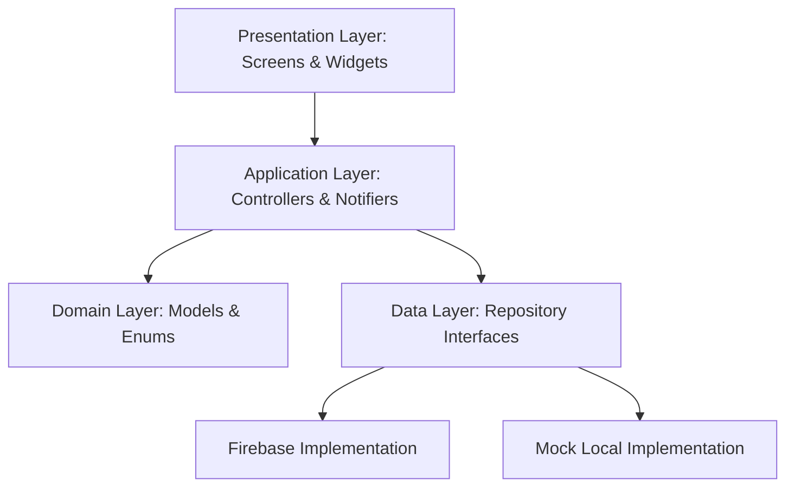

# Technical Writeup - SparkleLite Mobile & Web Application

This document outlines the architectural patterns, state management strategies, data persistence layer, privacy considerations, trade-offs, and production roadmap for the SparkleLite Flutter application.

---

## 1. Architecture

SparkleLite is designed using a modular, layered architecture inspired by clean architecture and domain-driven design principles. The codebase separates concerns into three distinct layers:

### 1.1. Core Layers
- **Presentation Layer**: Built with Flutter widgets optimized for multiple form factors. Breakpoint-based layouts (mobile/web) dictate responsive rendering (e.g. mobile bottom navigation vs. web side drawer).
- **Application Layer**: Contains StateNotifiers and AsyncNotifiers that orchestrate business logic and transform raw repository data into immutable state states consumed by the UI.
- **Domain Layer**: Houses lightweight entities (e.g., `SymptomLog`, `HealthRecord`, `ReminderModel`, `HealthProfile`) created using code generation (`freezed_annotation`, `json_annotation`) to enforce runtime immutability and simple JSON serialization.
- **Data Layer**: Enforces dependency inversion by defining abstract repository interfaces (e.g., `SymptomRepository`, `ReminderRepository`). The app dynamically switches between concrete `Firebase` and persistent `Mock` implementations using provider overrides.

---

## 2. Key Technical Decisions

### 2.1. Unified Zero-Config Mock Mode
To facilitate quick developer boarding and completely offline demonstration without Firebase infrastructure, the repository houses high-fidelity mock implementations of all service interfaces inside `mock_backend.dart`. Setting `useMockBackend = true` binds these mock repositories to the injection tree.

### 2.2. Interface Type Safety (Dynamic Casting)
Mock classes inherit directly from Firebase repository classes using Dart's native method delegation and inheritance. To ensure compatibility with custom mock signatures (e.g. adding local parameters or implementing additional helper fields) without code replication, mock providers use a standard dynamic cast (`as dynamic`) before registration in the Riverpod container.

---

## 3. State Management

The application leverages **Riverpod** for compile-time safe, unidirectional data flows.

### 3.1. Stream Providers for Real-time Auth
- `authStateProvider` maps repository session streams directly into reactive states.
- Re-architected `MockAuthRepository.authStateChanges` from a standard broadcast `StreamController` to an `async*` stream that yields `currentUser` instantly upon subscription. This guarantees late-subscribing widget trees do not miss the initial authentication state, preventing layout freezes.

### 3.2. Code-Generated AsyncNotifiers
- Controllers (e.g. `SymptomController`, `ProfileController`) use `@riverpod` annotations to generate type-safe dependencies.
- State is modeled using `AsyncValue<T>`, enabling declarative UI rendering for loading, error, and data states (e.g. `state.when(...)`).

---

## 4. Data Persistence

The persistence layer supports both Firebase cloud storage and persistent mock storage.

### 4.1. Local Database Engine (SharedPreferences)
- In persistent mock mode, `SharedPreferences` serves as the local persistent key-value store.
- Mock repositories (`MockProfileRepository`, `MockSymptomRepository`, `MockRecordRepository`, and `MockReminderRepository`) are injected with the `sharedPrefsProvider` instance.
- **Serialization Workflow**: Objects are converted to JSON maps (handling custom types such as converting Firestore `Timestamp` objects to ISO-8601 strings during local storage) and persisted as string keys (`mock_profile_json`, `mock_symptoms_json`, `mock_records_json`, `mock_reminders_json`).
- On app restart, these strings are parsed and injected back into the `MockDatabase` singleton, preserving data across app closes and logouts.

---

## 5. Privacy Considerations

- **Local Mark as Private Toggle**: Health records support an `isPrivate` attribute. In family profile modes, private files are hidden from shared queries and are only accessible by the record owner.
- **Biometric/Lock Prep**: State providers (such as `localAuthSuccessProvider`) allow developers to lock dashboard screens behind local device authentication guards without resetting the backend session.

---

## 6. Architectural Trade-offs

| Decision | Trade-off Benefit | Trade-off Drawback |
| :--- | :--- | :--- |
| **In-Memory + SharedPreferences Mock Backend** | Zero external dependencies, fast execution, completely offline out of the box. | Large database payloads (e.g. hundreds of symptom records) can increase JSON parsing overhead on UI main thread. |
| **Dynamic Casting of Mock Repositories** | Quick implementation of mock variants without mirroring complex interfaces. | Bypass of compiler static analysis on repositories; parameter signature changes must be matched manually. |
| **Monolithic Router Redirection** | Single source of truth for routing guards and auth status redirects. | High coupling between auth notifier and router navigation triggers. |

---

## 7. Production Roadmap

If moving this codebase to production, the following engineering steps would be prioritized:

1. **SQLite Database Integration**:
   Replace the `SharedPreferences` JSON storage layer with `sqlite` (using `drift` or `sqflite`) for structured SQL schemas, supporting ACID compliance, database migrations, and complex multi-table queries (e.g. joining logs and profiles).
2. **Encrypted Storage for Health Data**:
   Migrate credentials, tokens, and sensitive health profiles to highly secure hardware keystores (using `flutter_secure_storage` to leverage iOS Keychain and Android Keystore).
3. **App Check & Firewalls**:
   Enforce Firebase App Check in production to restrict API access solely to legitimate application binaries, blocking automated script access or unauthorized third-party clients.
4. **Isolate-based JSON Parsing**:
   Perform heavy JSON serialization/deserialization workflows inside separate background CPU threads (Dart `Isolate`s) to completely avoid frame drops on the main thread during heavy data queries.
